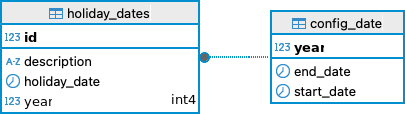
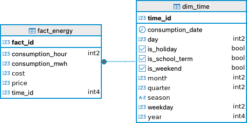

# 📄 Documentación Técnica: Reporte de Rentabilidad Energética

> **Descripción**  
> Flujo completo de ETL, análisis y generación de reportes de rentabilidad energética.  
> **Fecha:** 10-Jun-2025 · **Autor:** Grupo 8

---

## 📑 Contenidos

1. [🔧 Herramientas y Librerías](#🔧-herramientas-y-librerías)  
2. [⭐ Modelo de Datos (Esquema Star)](#⭐-modelo-de-datos-esquema-star)  
3. [🔄 Flujo ETL](#🔄-flujo-etl)  
4. [📊 Módulo de Análisis](#📊-módulo-de-análisis)  
5. [📝 Generación de Reporte](#📝-generación-de-reporte)  

---

## 🔧 Herramientas y Librerías

| Herramienta / Paquete     | Versión        | Descripción                                    |
|:-------------------------:|:--------------:|:-----------------------------------------------|
| **Python**                | `3.13+`         | Lenguaje principal                             |
| **SQLAlchemy**            | —              | ORM para modelar tablas y ejecutar consultas   |
| **pandas**                | —              | Transformación de datos y exportación Markdown |
| **openpyxl**              | —              | Lectura de Excel (`.xlsx`)                     |
| **python-dotenv**         | —              | Carga de variables de entorno (`.env`)         |
| **psycopg2-binary**       | —              | Conector PostgreSQL                            |
| **matplotlib**            | —              | Gráficos estáticos (línea, barras, etc.)       |
| **tabulate** *(opcional)* | —              | Exportar DataFrames a Markdown                 |

### Variables de entorno
| Nombre     | Descripcion        | 
|:-------------------------|:--------------|
| DATABASE_URL     | URL de postgres        | 
| EXCEL_PATH     | ruta del archivo de carga ejemplo data/raw/POE_2023.xlsx        | 
---

## ⭐ Modelo de Datos
### Scripts SQL
    src/db/
    ├── insert_config_dml.sql   # Script de inserccion
    ├── model_ddl.sql  # Script de creacion

| Esquema   | Tabla           | Claves / Columnas relevantes                                                                                                                                         |
|:---------:|:----------------|:---------------------------------------------------------------------------------------------------------------------------------------------------------------------|
| **energy**| `dim_time`      | `time_id`, `consumption_date`, `year`, `quarter`, `month`, `day`, `weekday`, `is_weekend`, `season`, `is_school_term`, `is_holiday`                                     |
| **energy**| `fact_energy`   | `fact_id`, `time_id` (FK → `dim_time`), `consumption_hour`, `consumption_mwh`, `price`, `cost`                                                                       |
| **mcs**   | `config_date`   | `year`, `start_date`, `end_date`                                                                                                                                    |
| **mcs**   | `holiday_dates` | `id`, `year` (FK → `mcs.config_date.year`), `holiday_date`, `description`                                                                                            |
---

## Diagrama para configuracion de fechas
<p align="center">
  
</p>

## Diagrama de estrella utilizado
---
<p align="center">
  
</p>


## 🔄 Flujo ETL

    src/etl/
    ├── extract.py    # Extracción de datos
    ├── transform.py  # Transformacion de datos
    ├── load.py       # Carga de datos
    └── main.py       # Funcion principal

1. **Extract** (`extract.py`)  
   - Lee cada hoja de `POE_2023.xlsx`  
   - Renombra columnas de hora, filtra rango `0–23`  
   - Convierte a formato “largo” con `Hora_inicio`, `Hora_fin` y `consumption_date`

2. **Transform** (`transform.py`)  
   - Genera **`dim_time`** con atributos derivados:  
     - `season` (invierno/primavera/verano/otoño)  
     - Flags `is_holiday`, `is_school_term` (consulta a tablas `mcs`)  
   - Calcula `consumption_mwh` y `cost`  
   - Construye `fact_df` para cargar en `fact_energy`

3. **Load** (`load.py`)  
   - Asegura esquemas `energy` y `mcs`  
   - Inserta o actualiza (`upsert`) en:  
     - `dim_time`  
     - `fact_energy`  
     - `config_date`  
     - `holiday_dates`  

4. **Ejecucion** (`main.py`)  
    pip install -r requirements.txt  
    PYTHONPATH=. python -m src.etl.main  
   - Ejecuta en secuencia: `init_db()` → `extract()` → `transform()` → `load()`

---

## 📊 Módulo de Análisis

Archivo: `src/analytics.py`

| Función                                            | Descripción                                                                            |
|:--------------------------------------------------:|:---------------------------------------------------------------------------------------|
| `monthly_energy_cost(labor_start, labor_end)`      | Suma costos mensuales dentro del horario laboral                                        |
| `cost_for_model(rate, labor_start, labor_end, time_factor)` | Ajusta costos según nueva tarifa y factor de tiempo                                      |
| `most_and_least_profitable()`                      | Identifica mes más rentable y menos rentable                                            |
| `scenario_costs(month, rate, labor_start, labor_end, time_factor)` | Calcula costos para diferentes esquemas de descansos (escenarios A, B, C)                |

---

## 📝 Generación de Reporte

Script: `src/report.py`

1. **Preparación de Datos**  
   - Combina resultados de funciones de análisis en `DataFrames`  
   - Métricas importantes:  
     - Mes más rentable  
     - Mes menos rentable  
     - Costos por tipo de día, estación, fines de semana y feriados  
     - Comparación de escenarios  

2. **Creación de Gráficos**  
   - 📈 Tendencia mensual (real vs. modelo)  
   - 📉 Tendencia sin fines de semana  
   - 📊 Tendencia sin feriados  
   - ⚙️ Escenarios de descanso  
   - 🌐 Costo por tipo de día y estación  
   - 🔄 Comparación de escenarios  

---

## 🚀 Ejecucion

---
```Bash
# Una vez se tenga el entorno de python instalar dependencias
 pip install -r requirements.txt    
# Una vez se hayan corrido los scripts de SQL correr el etl
 python -m src.etl.main
# Probar las funciones para verificar los insigths principales
 python -m src.analytics.average_metrics
# Correr la generacion de graficas para el reporte
 python -m src.report.assets
```