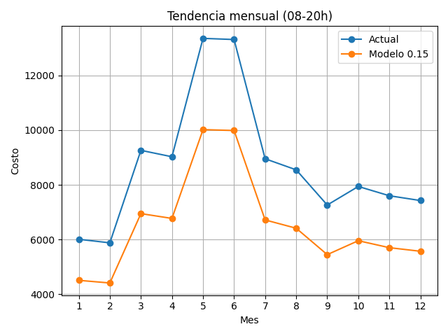
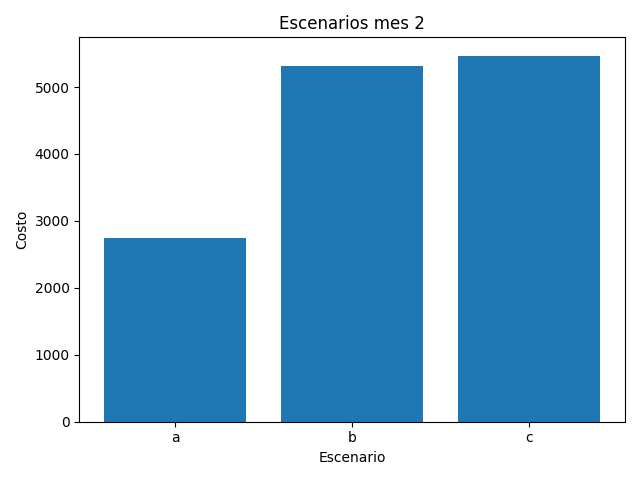
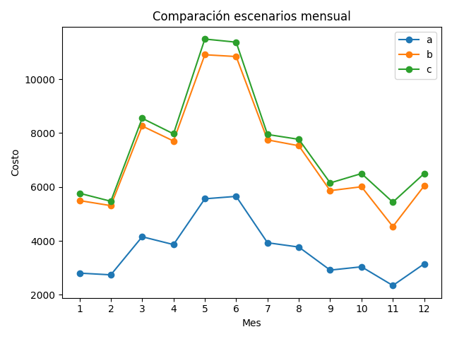
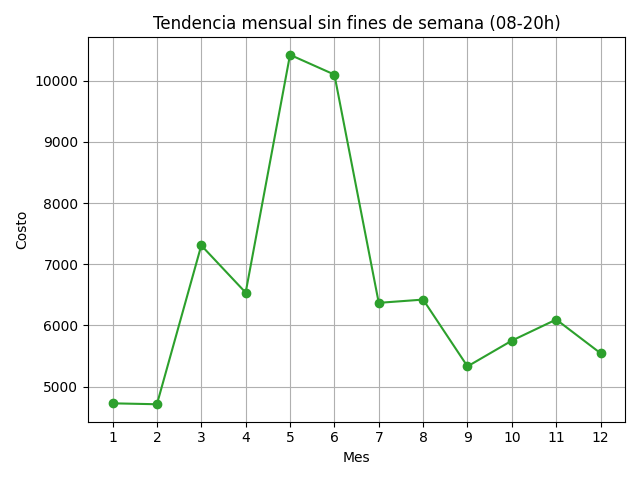
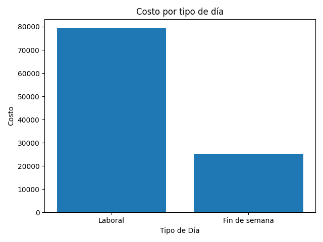
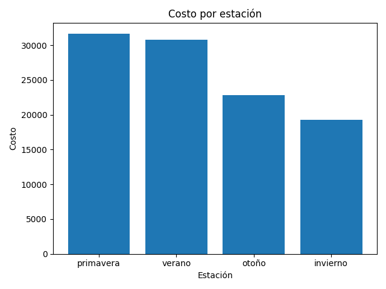

# Reporte de Rentabilidad Energética 
**Grupo:** 8  
**Fecha:** 10 de junio de 2025  
**Documentacion Técnica:** [https://github.com/edpo1998/ModelacionySimulacion1](https://github.com/edpo1998/ModelacionySimulacion1)

---

> **Insights clave**  
> - Costo **Promedio Mensual** 0.2 MWh Jornada Completa (8714,86)
> - Costo **Promedio Mensual** 0.15 MWh Jornada Completa (6536,14)
> - Costo **Promedio Mensual** 0.15 MWh Trabajando la mitad (3268.073) 
> - Mes **más rentable**: **Febrero** (5 877,67)  
> - Mes **menos rentable**: **Mayo** (13 359,50)  

---

## Resumen de Costos

| No  | **Mes**       | **Costo (0,2 MWh)** | **Costo (0,15 MWh)** |
|----:|:--------------|--------------------:|---------------------:|
| 1   | Enero         | 6 006,78            | 4 505,09             |
| 2   | **Febrero**   | **5 877,67**        | **4 408,25**         |
| 3   | Marzo         | 9 261,82            | 6 946,36             |
| 4   | Abril         | 9 027,44            | 6 770,58             |
| 5   | **Mayo**      | **13 359,50**       | **10 019,60**        |
| 6   | Junio         | 13 317,10           | 9 987,82             |
| 7   | Julio         | 8 953,27            | 6 714,95             |
| 8   | Agosto        | 8 548,81            | 6 411,60             |
| 9   | Septiembre    | 7 260,77            | 5 445,58             |
| 10  | Octubre       | 7 940,07            | 5 955,06             |
| 11  | Noviembre     | 7 600,25            | 5 700,19             |
| 12  | Diciembre     | 7 424,84            | 5 568,63             |

---

## Tendencia Mensual

  

---

## Escenarios De Inversores

| **Escenario** | **Periodo 1**   | **Periodo 2**   | **Costo (Q.)** |
|:-------------|:----------------|:----------------|---------------:|
| **A**        | 00:00 – 04:00   | 12:00 – 16:00   | 2 738,55       |
| **B**        | 08:00 – 12:00   | 16:00 – 20:00   | 5 306,88       |
| **C**        | 08:00 – 12:00   | 20:00 – 24:00   | 5 468,81       |

  

---

## 🔄 Comparación Mensual de Escenarios

| **Mes** | **A**     | **B**      | **C**      |
|--------:|----------:|-----------:|-----------:|
| 1       | 2 801,83  | 5 494,15   | 5 765,98   |
| 2       | 2 738,55  | 5 306,88   | 5 468,81   |
| 3       | 4 152,09  | 8 260,84   | 8 548,11   |
| 4       | 3 860,82  | 7 704,78   | 7 971,06   |
| 5       | 5 559,94  | 10 906,40  | 11 488,70  |
| 6       | 5 650,28  | 10 839,40  | 11 372,50  |
| 7       | 3 929,75  | 7 746,68   | 7 946,99   |
| 8       | 3 768,93  | 7 529,06   | 7 767,08   |
| 9       | 2 913,39  | 5 862,72   | 6 148,90   |
| 10      | 3 036,83  | 6 007,25   | 6 497,23   |
| 11      | 2 341,75  | 4 529,40   | 5 434,32   |
| 12      | 3 146,10  | 6 040,37   | 6 496,61   |

  

---

## Tendencia Adicionales agregando las variables

### Tendencia sin fines de semana

  

### Tendencia sin feriados

  

### Costos por Tipo de Día (08–20 h)

| **Tipo de Día**      | **Costo (Q.)** |
|:---------------------|---------------:|
| Laboral              | 79 326,40      |
| Fin de semana        | 25 252,00      |

  

---

### Costos por Estación

| **Estación** | **Costo (Q.)** |
|:-------------|---------------:|
| Primavera    | 31 648,80      |
| Verano       | 30 819,20      |
| Otoño        | 22 801,10      |
| Invierno     | 19 309,30      |

  

---

> **✅ Conclusiones**  
> 1. Los costos de energía presentan un mínimo en febrero y un pico en mayo.  
> 1.1 Costo Promedio Mensual con 0.2 MWh en Jornada Completa (8714,86)
> 1.2 Costo Promedio Mensual con 0.15 MWh en Jornada Completa (6536,14) 
> 1.2 Costo Promedio Mensual con 0.15 MWh Trabajando la Mitad (6536,14) 
> 2. La tendencia con 0.15 MWh trabajando la mitad no genera cambios en la rentabilidad.
> 3. El escenario A (00–04h / 12–16h) presenta menor consumo es probable que sea importante considerar horas de calor, y que los horarios nocturnos pueda ayudar a reducir el consumo y mejorar la rentabilidad.
> 4. Se valida que es importante considerar las variables extras para analizar si esos dias no hubiera operabilidad.   
> 4.1 Excluir fines de semana y feriados suaviza la curva de costos sin alterar la tendencia general.  
> 4.2 Los días laborales concentran más de un 75 % del gasto total.  
> 4.3 La primavera y el verano son las estaciones con mayor consumo económico, es asi como se concluye que el calor si es un factor importante a considerar para reducir costos.

